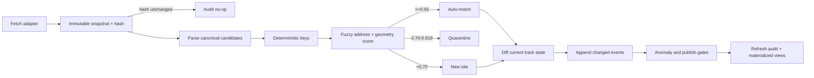

# Ingestion and Monthly Pipeline

## Run contract

1. Fetch each municipality independently and store content hash before parsing.
2. If `(source_id, sha256)` exists, record an unchanged run and stop that adapter.
3. Parse to canonical candidates with field provenance.
4. Entity resolution priority: exact application number; exact roll number; normalized address plus geometry; scored fuzzy match.
5. Auto-match score >=0.92; quarantine 0.70–0.919; below 0.70 creates a new site only if minimum identity fields pass.
6. Diff latest accepted events and append only changed stage/field events.
7. Flag illegal taxonomy transitions. Flag mass change if >20% of a municipality's active records change stage or record count shifts >30% month over month.
8. Publish only after QA gates. Record fetched, unchanged, new, changed, quarantined, errored and warning counts.

Idempotency invariant: processing the same source snapshot and adapter version twice creates zero new sites, identifiers, tracks or entitlement events.

Recommended schedule: first Sunday monthly at 03:15 America/Toronto, with a second retry window at 06:15 for failed adapters only. Use a database advisory lock plus unique snapshot/event keys, not cron timing, for concurrency safety.

## Failure matrix

| Stage | Failure | Behaviour |
|---|---|---|
| Fetch | timeout/5xx | exponential retry; fail adapter, continue others |
| Snapshot | hash/object write | abort adapter; never parse untracked bytes |
| Parse | schema drift | quarantine batch; alert with sample diff |
| Match | ambiguity | quarantine candidate; no auto-merge |
| Diff | illegal transition | retain candidate event as pending warning |
| Publish | QA gate fails | keep prior published snapshot; mark run blocked |
| Audit | DB failure | whole adapter transaction rolls back |

Metrics/alerts: adapter success, data age, unchanged streak, parse yield, quarantine rate, illegal transitions, record-count delta, runtime and last successful publish. Two consecutive failures or data age >45 days is actionable.
