# OSFI Lowers the Domestic Stability Buffer to 3.0%: Why It Could Free Up More Mortgage Capital

Date: 2026-06-19

Primary sources:
- https://www.osfi-bsif.gc.ca/en/news/osfi-lowers-domestic-stability-buffer-30-so-canadas-largest-banks-can-deploy-more-capital
- https://www.osfi-bsif.gc.ca/en/supervision/financial-institutions/banks/domestic-stability-buffer/domestic-stability-buffer-decision-summary-note-june-2026

## Executive summary

On June 19, 2026, OSFI lowered the Domestic Stability Buffer (DSB) for Canada's domestic systemically important banks from `3.5%` to `3.0%` of risk-weighted assets and cut the top end of the DSB range from `4%` to `3%`. That reduces the supervisory Common Equity Tier 1 (CET1) expectation for the big banks to `11.0%`.

OSFI's stated reason is that Canada's largest banks are already well capitalized, with an average CET1 ratio of `13.5%`, and can now deploy more of that excess capital into the economy. OSFI explicitly frames the move as a way to support lending and risk-taking through a period of change in trade, geopolitics, infrastructure, defence, resources, and AI.

The mortgage implication is not stated directly by OSFI, but it is a reasonable inference. A lower capital buffer gives large banks more room to grow risk-weighted assets without raising new equity first. Since residential mortgages are a core asset class for Canadian banks, part of that added capacity could flow into mortgage originations, renewals, refinancing, warehouse lines, and construction-related credit. It does not guarantee easier mortgage credit, but it improves the system's capacity to provide it.

## What changed

- DSB cut to `3.0%` from `3.5%`.
- DSB range cut to `0% to 3%` from `0% to 4%`.
- Big-bank CET1 supervisory expectation lowered to `11.0%`.
- This is OSFI's first DSB level change since June 2023.

OSFI also said the six largest banks still sit well above the new expectation, averaging `13.5%` CET1 as of April 30, 2026. In its news release, OSFI said that cushion represents about `$74 billion` of capital, equivalent to roughly `$673 billion` of risk-weighted asset expansion across the sector.

## Why OSFI says it is comfortable cutting the buffer

OSFI's rationale is straightforward:

- The banks have remained profitable and well capitalized.
- Expected credit loss provisioning has stabilized.
- Credit growth has picked up, though still below long-run norms.
- Stress tests suggest banks can absorb significant shocks while continuing to lend.
- Broader system vulnerabilities are still elevated, but have been relatively stable.

The decision note still highlights familiar Canadian vulnerabilities: household indebtedness remains high, house prices are still elevated relative to fundamentals even after cooling, and unemployment and delinquencies have risen but remain within historically normal ranges.

## Why this could lead to more mortgage capital

This section is an inference from OSFI's capital decision, not a direct OSFI quote.

Lowering the DSB does not force banks to make more mortgages. What it does is reduce the amount of CET1 capital they must hold against a given stock of risk-weighted assets. That matters because capital is one of the main constraints on balance-sheet growth.

In practice, that can support mortgage credit in a few ways:

- More origination capacity: banks have more room to add insured and uninsured mortgage exposure before capital becomes binding.
- More renewal and refinance flexibility: lenders can keep competing for high-quality borrowers instead of preserving as much capital headroom.
- More support for housing-adjacent credit: home equity lines, builder finance, land loans, and insured multifamily lending can all benefit from a looser aggregate capital constraint.
- Better pricing resilience: if capital is less scarce, banks may be less aggressive about widening spreads solely to ration balance sheet.

The most important caveat is that mortgage capital does not move only with capital rules. It also depends on funding costs, unemployment, home prices, arrears, OSFI underwriting standards, securitization conditions, and banks' internal risk appetite. So the likely effect is "more capacity to lend" rather than "automatic mortgage easing."

## Real estate read-through

For housing markets, the cleanest interpretation is that OSFI is trying to preserve resilience while making sure capital rules do not unnecessarily choke off credit during a slower, more uncertain cycle.

That matters because mortgage markets usually tighten before housing weakens materially. If large banks have more room to keep lending, renew loans, and absorb demand for prime mortgage credit, that can reduce the odds of an avoidable credit crunch. It is more supportive for mortgage availability than for home prices directly, but the two are linked.

For borrowers and investors, the likely first-order effects are:

- Prime borrowers may continue to see strong competition from large-bank lenders.
- Multifamily and insured rental lending could remain better supported than feared if banks use some released capacity there.
- A softer capital constraint may help keep refinancing channels open for stronger borrowers even if the macro backdrop stays uneven.
- The move is more likely to support credit availability than to trigger a broad drop in mortgage rates by itself.

## What the charts show

The decision note's chart package argues that vulnerabilities are still real, but not deteriorating fast enough to justify keeping the old, higher buffer.

### 1. Household leverage is still high

OSFI shows the household debt-to-income ratio rising again into early 2026, to `179.4%` in `March 2026`, but still below recent highs.

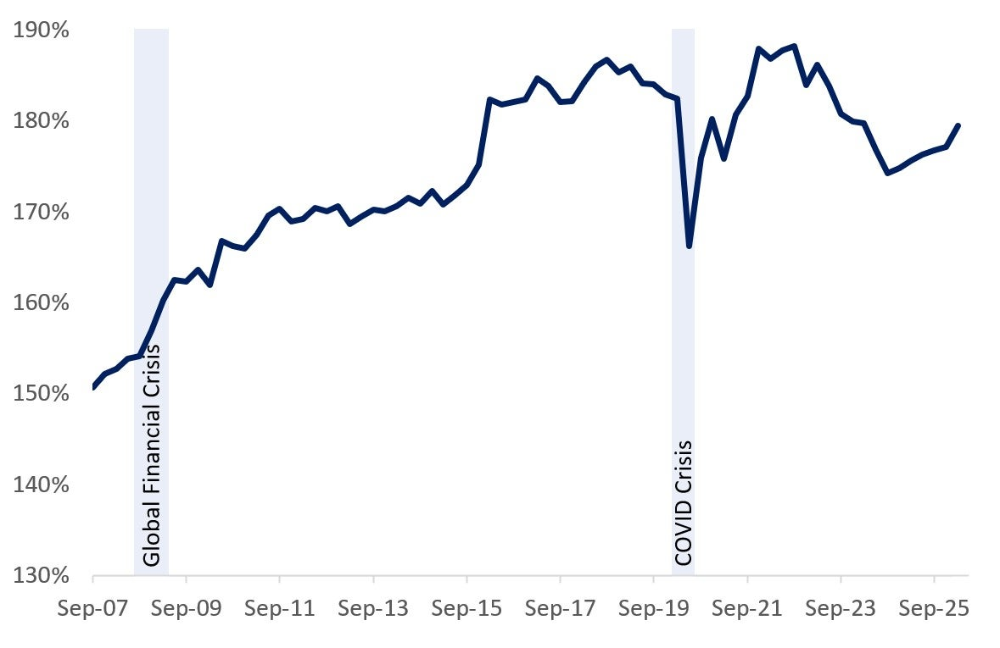

### 2. Home prices have cooled relative to income

OSFI's house price-to-income index fell to `144.53` in `March 2026` from much higher 2021-2023 levels, suggesting valuations have come off the peak even if they still look elevated versus fundamentals.

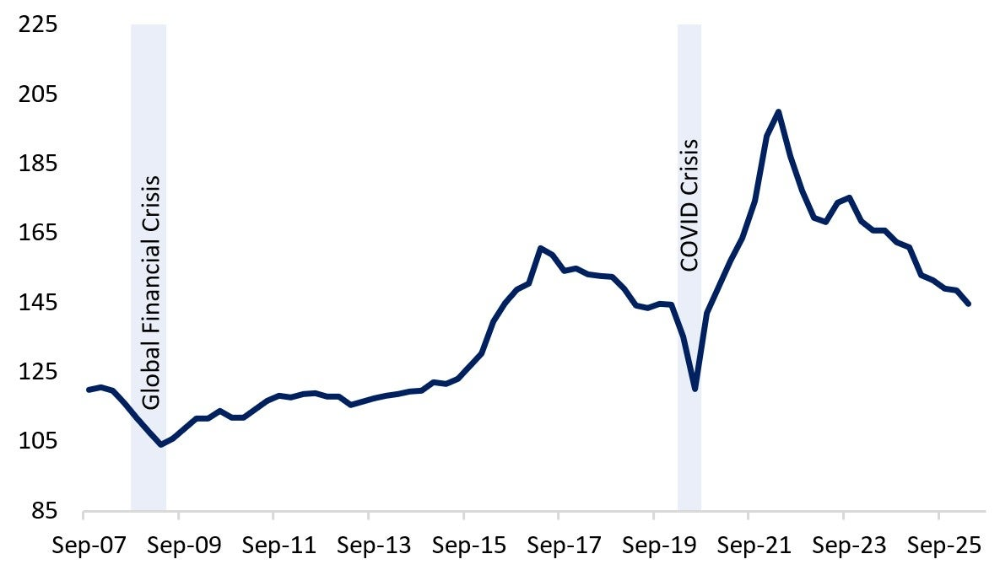

### 3. Debt-service pressure remains elevated

The household debt service ratio ticked up to `14.75%` in `March 2026`, below 2023 highs but still historically heavy enough to matter for mortgage sensitivity.

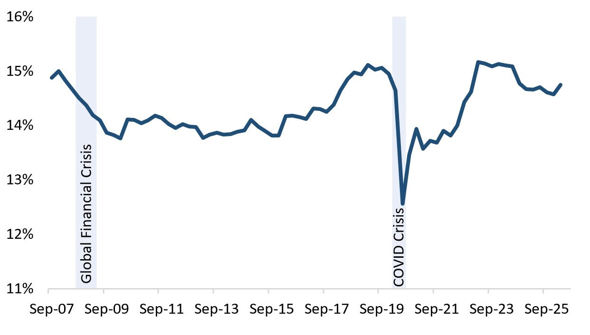

### 4. Corporate leverage is still a macro vulnerability

OSFI also keeps an eye on non-financial corporate debt-to-GDP, which has been rising again since 2022.

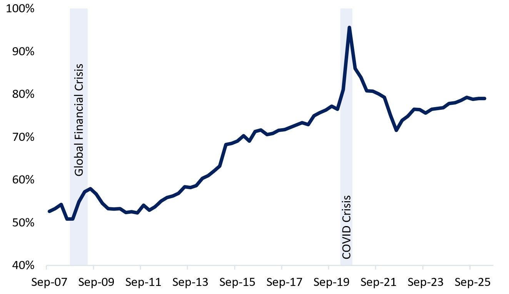

### 5. Geopolitics still matter

The geopolitical risk index chart supports OSFI's point that the external environment is unstable even though domestic banks remain strong.

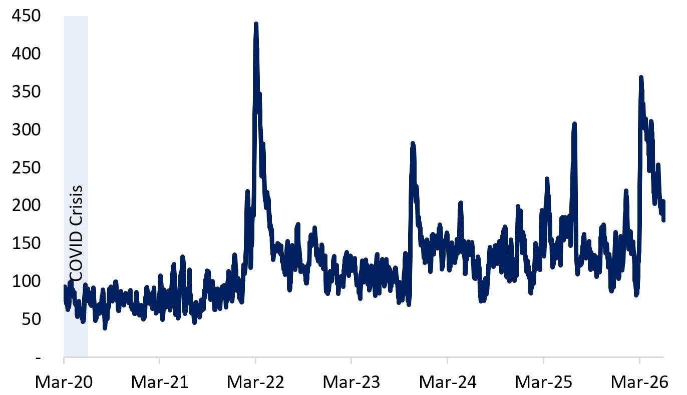

### 6. Trade uncertainty has cooled from the spike

Trade policy uncertainty remains elevated in the background, but has eased from earlier spikes.

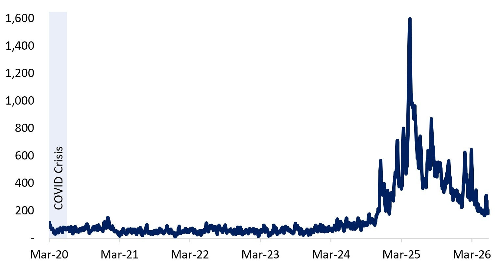

### 7. Bank capital levels remain comfortably above the new minimum

This is the core chart behind the decision. Average D-SIB CET1 ratios remain above `13.5%`, well above the new `11.0%` supervisory expectation.

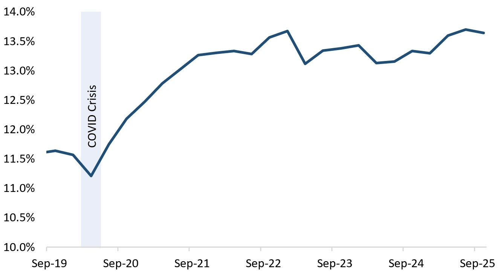

### 8. Unemployment has risen, but not to crisis levels

OSFI notes the unemployment rate reached `6.6%` in `May 2026`, which is higher, but still not a crisis reading by historical standards.

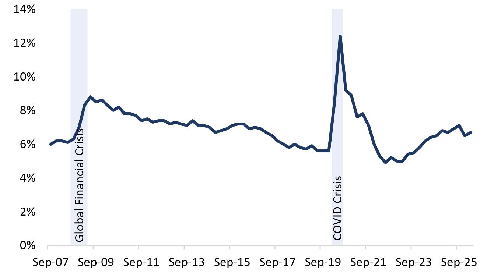

### 9. Loss provisioning looks contained

The expected credit loss coverage ratio has increased gradually, which supports OSFI's view that banks are provisioning prudently rather than falling behind credit deterioration.

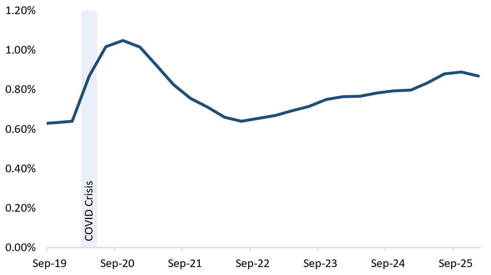

### 10. Impaired loans have risen, but remain manageable

Gross impaired loans have been climbing, though OSFI still describes overall delinquencies and credit losses as within historically normal ranges.

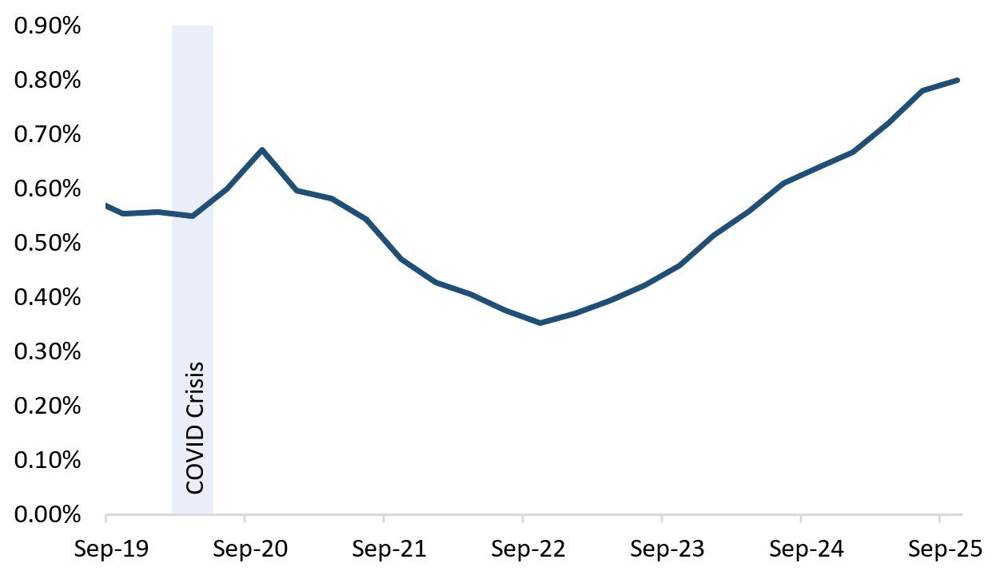

### 11. Funding spreads widened briefly, then eased

Bank funding spreads moved up in February-March 2026 and then fell back, consistent with a market that is alert but not disorderly.

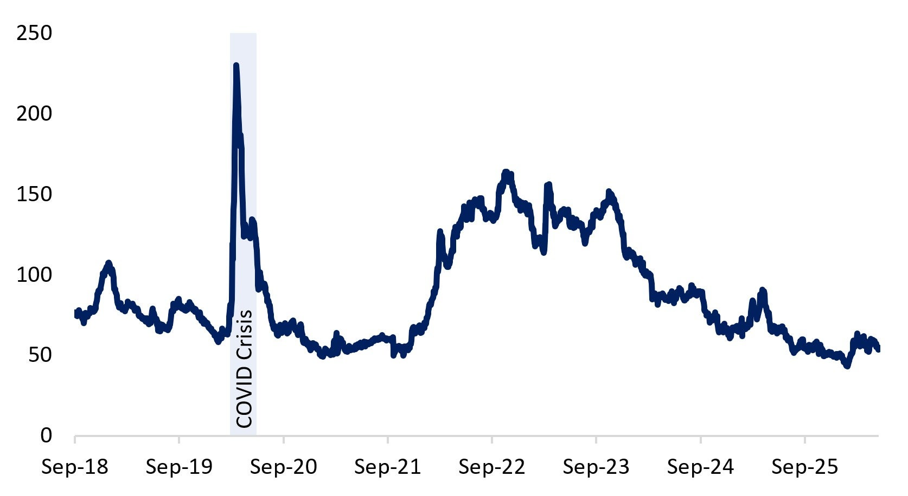

## Bottom line

OSFI is telling the market that Canadian banks are strong enough to operate with a slightly smaller capital buffer and should use some of that excess capacity to support the economy. For housing and real estate, the practical implication is that the large banks now have somewhat more room to extend mortgage credit and adjacent housing finance without new equity needing to do as much of the work.

That does not mean a mortgage boom is coming. It means the regulatory backdrop has become modestly more supportive for mortgage capital at the margin.
